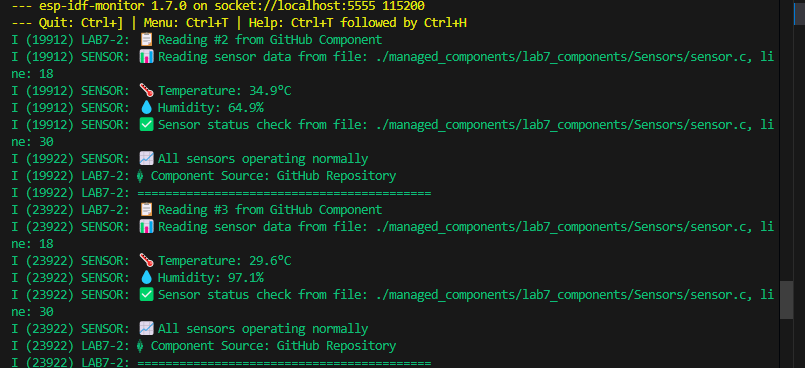

# Lab 7-2: Managed Component from GitHub URL Demo

## คำอธิบาย
การทดลองนี้แสดงการใช้งาน managed component จาก GitHub Repository
ใช้ `Sensors` component จาก https://github.com/APPLICATIONS-OF-MICROCONTROLLERS/Lab7_Components

## ผลลัพธ์ที่คาดหวัง
- แสดงข้อความการเริ่มต้น sensor จาก GitHub component
- แสดงข้อมูล temperature และ humidity ทุก 4 วินาที
- แสดงสถานะการทำงานของ sensor
- แสดงแหล่งที่มาของ component (GitHub Repository)

## ความแตกต่างจาก Lab 7-1
- Lab 7-1: ใช้ local component (ในเครื่อง)
- Lab 7-2: ใช้ managed component จาก GitHub URL

## การใช้งาน
1. เข้าไปในโฟลเดอร์ lab7-2_Managed_url_Component
2. รันคำสั่ง `idf.py build` (จะดาวน์โหลด component จาก GitHub อัตโนมัติ)
3. ทดสอบด้วย QEMU    

2. นำโค้ดจาก main.c ในใบงานที่ 6 มาใช้ แล้ว build พร้อมทดสอบ
ให้ผลลักษณะเดียวกับ component แบบ local หรือไม่
