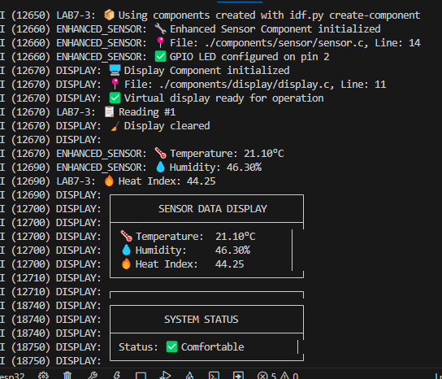

# Lab 7-3: Custom ESP32 Components (Sensor + Display)

## คำอธิบาย
การทดลองนี้แสดงการสร้าง component ใหม่ด้วยคำสั่ง `idf.py create-component`
สร้าง 2 components:
1. **Sensor Component** - อ่านค่า temperature, humidity และคำนวณ heat index
2. **Display Component** - แสดงผลข้อมูลในรูปแบบตาราง

## โครงสร้างโฟลเดอร์หลังใช้ create-component
lab7-3_esp32_Component/
├── CMakeLists.txt
├── components/
│   ├── sensor/
│   │   ├── CMakeLists.txt
│   │   ├── include/
│   │   │   └── sensor.h
│   │   └── sensor.c
│   └── display/
│       ├── CMakeLists.txt
│       ├── include/
│       │   └── display.h
│       └── display.c
├── main/
│   ├── CMakeLists.txt
│   └── lab7-3.c
├── build/
└── README.md

    